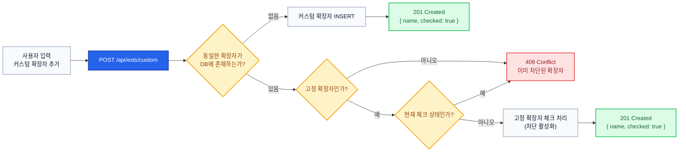
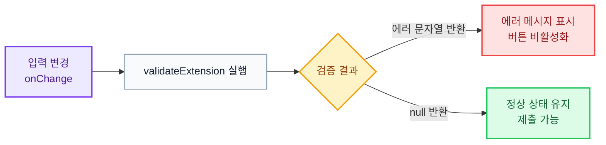
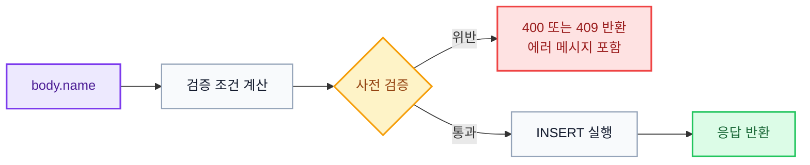
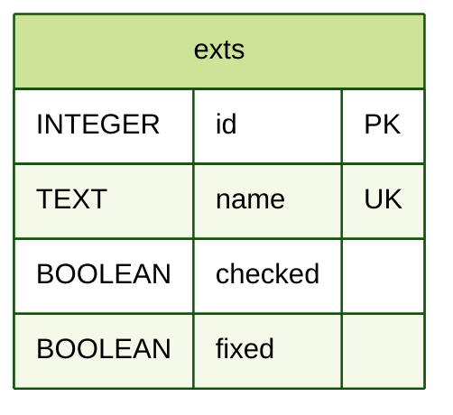

# 파일 확장자 차단 과제

<br />

## 목차

- [파일 확장자 차단 과제](#파일-확장자-차단-과제)
  - [목차](#목차)
  - [배포 주소](#배포-주소)
  - [기술 스택](#기술-스택)
    - [Frontend](#frontend)
    - [Backend](#backend)
    - [Database](#database)
    - [Infra / DevOps](#infra--devops)
  - [아키텍쳐 다이어그램](#아키텍쳐-다이어그램)
  - [고려사항](#고려사항)
    - [1. 커스텀 확장자에 고정 확장자를 추가하는 경우](#1-커스텀-확장자에-고정-확장자를-추가하는-경우)
    - [2. 커스텀 확장자 validator 설계](#2-커스텀-확장자-validator-설계)
      - [화면](#화면)
      - [구현](#구현)
      - [예시 1) 한글로 된 확장자를 추가하는 경우](#예시-1-한글로-된-확장자를-추가하는-경우)
      - [예시 2) 중복되는 커스텀 확장자를 추가하는 경우](#예시-2-중복되는-커스텀-확장자를-추가하는-경우)
    - [3. 커스텀 확장자 모두 삭제 기능](#3-커스텀-확장자-모두-삭제-기능)
  - [API 설계](#api-설계)
  - [DB 스키마 (ERD)](#db-스키마-erd)
    - [확장자를 단일 테이블로 관리한 이유](#확장자를-단일-테이블로-관리한-이유)
  - [실행 방법](#실행-방법)
    - [로컬 실행 방법](#로컬-실행-방법)
    - [테스트 방법](#테스트-방법)
      - [테스트 항목](#테스트-항목)
  - [배포 방법](#배포-방법)
    - [1. 프로젝트 준비](#1-프로젝트-준비)
    - [2. 프론트엔드 빌드](#2-프론트엔드-빌드)
    - [3. Nginx 설정](#3-nginx-설정)
    - [4. 백엔드 실행 (systemd)](#4-백엔드-실행-systemd)
    - [5. 이후 코드 업데이트 시](#5-이후-코드-업데이트-시)

<br />

## 배포 주소

[http://34.83.73.77](http://34.83.73.77/)

<br />

## 기술 스택

### Frontend

<span>
  
  
  
  
</span>

<br />

### Backend

<span>
  
  
  
  
</span>

<br />

### Database

<span>
  
</span>

<br />

### Infra / DevOps

<span>
  
  
  
  
  
</span>

<br />
<br />


## 아키텍쳐 다이어그램


<br />
<br />
<br />


## 고려사항

### 1. 커스텀 확장자에 고정 확장자를 추가하는 경우

"고정 확장자를 체크하는 것"과 "커스텀 확장자를 추가하는 것"은 **해당 확장자를 차단한다**는 목적이 동일합니다. <br />
따라서 커스텀 입력란에 이미 고정 목록에 포함된 확장자를 입력하는 경우, **위쪽 고정 목록을 확인하지 못한 실수로 간주**하여 설계하였습니다.

즉, 고정 목록에 존재하지만 아직 미체크 상태인 확장자를 커스텀으로 추가하려 하면, <br />
에러로 처리하는 대신 **해당 고정 확장자를 체크 처리**하여 차단 효과가 동일하게 적용되도록 하였습니다.


<br />
<br />

서버는 아래 흐름으로 처리합니다.



<br />

### 2. 커스텀 확장자 validator 설계

과제 요구사항과 추가로 정한 규칙을 함께 적용하여 아래와 같은 검증 조건을 두었습니다.

<br />

> 1. "확장자는 20자를 초과하여 입력할 수 없습니다" `과제 요구사항`
> 2. "커스텀 확장자는 최대 200개까지 추가할 수 있습니다" `과제 요구사항`
> 3. "확장자는 영문자/숫자 이외의 문자를 사용할 수 없습니다" `추가 규칙`
> 4. "이미 차단되어 있습니다" `추가 규칙` <br />
> &emsp; 4.1. 이미 추가된 커스텀 확장자를 다시 추가하는 경우 <br />
> &emsp; 4.2. 이미 체크된 고정 확장자를 커스텀 확장자에 추가하는 경우

<br />

이 검증들은 **역할**에 따라 **Client Validation** 과 **Server Validation** 으로 나누었습니다.

- **Client Validation** 은 입력이 변경될 때마다 **영문자 및 숫자 여부**와 **20자 초과 여부**를 검사하여 화면에 메시지를 표시하고, <br /> 검증에 실패하면 요청을 전송하지 않습니다.

- **Server Validation** 은 요청으로 전달된 확장자를 기준으로 **개수 한도, 중복, 고정 확장자와의 충돌 여부**를 검사합니다. <br /> 위반 시 응답 본문의 `error.message` 에 안내 문구를 담아 반환하고, 화면은 해당 문자열을 그대로 출력합니다. <br /> 클라이언트를 거치지 않고 API를 직접 호출하는 경우에도 대응하기 위해 서버에서 동일한 기준으로 한 번 더 검증합니다.


<br />

#### 화면

| 케이스 | 화면 |
|---|---|
| 영문자/숫자 이외의 문자 입력 |  |
| 커스텀 확장자 200개 초과 |  |
| 20자 초과 입력 |  |
| 커스텀 확장자 추가 및 재추가 |  |
| 고정 확장자를 커스텀에 추가 |  |

<br />

#### 구현

<br />

**프론트엔드** (`useValidator`): <br />

입력이 변경될 때마다 검사를 수행하고, 반환된 안내 메시지를 입력란 밑에 표시하며 제출을 차단합니다.





```tsx
function useValidator() {

  const validateCharacter = (name: string) => name.length && !/^[a-zA-Z0-9]+$/.test(name);
  const validateLength = (name: string) => name.length > 20;

  const validateExtension = (name: string) => {
    if (validateCharacter(name)) return "확장자는 영문자/숫자 이외의 문자를 사용할 수 없습니다";
    if (validateLength(name)) return "확장자는 20자를 초과하여 입력할 수 없습니다";
    return null;
  }

  return { validateExtension };
}
```

<br />

**백엔드** (`postExtsCustom`): <br />

DB의 행(`row`)과 요청 확장자를 바탕으로 검증 조건을 계산한 뒤 순서대로 검증하고, <br />
위반이 확인되면 `EXT_MESSAGES`를 담은 `BadRequestError(400)` 또는 `ConflictError(409)` 를 던집니다.

모든 검증을 통과한 경우에만 고정 확장자 체크 처리 또는 `INSERT` 를 실행합니다.




```js
// conditions
const INVALID_NAME_CHARS = name && !/^[a-zA-Z0-9]+$/.test(name);
const LONG_NAME = name && name.length > CUSTOM_NAME_MAX;
const COUNT_EXCEEDED = !row && repo.getCustomExts().length >= CUSTOM_MAX;
const ALREADY_BLOCKED = row && !row.fixed || row && row.fixed && row.checked;

// 사전 throws
if (!name) throw new BadRequestError(EXT_MESSAGES.NAME_REQUIRED);
if (INVALID_NAME_CHARS) throw new BadRequestError(EXT_MESSAGES.NAME_INVALID_CHARS);
if (LONG_NAME) throw new BadRequestError(EXT_MESSAGES.NAME_TOO_LONG);
if (COUNT_EXCEEDED) throw new BadRequestError(EXT_MESSAGES.LIST_FULL);
if (ALREADY_BLOCKED) throw new ConflictError(EXT_MESSAGES.ALREADY_BLOCKED);

// 메인 로직: INSERT
```

<br />

#### 예시 1) 한글로 된 확장자를 추가하는 경우

**요청:**

```http
POST /api/exts/custom HTTP/1.1
Content-Type: application/json

{"name":"안녕하세요"}
```

**응답:** `400`

```json
{
  "ok": false,
  "status": 400,
  "data": null,
  "error": { "message": "확장자는 영문자/숫자 이외의 문자를 사용할 수 없습니다" }
}
```

<br />

#### 예시 2) 중복되는 커스텀 확장자를 추가하는 경우

**요청:**

```http
POST /api/exts/custom HTTP/1.1
Content-Type: application/json

{"name":"dup"}
```

**응답:** `409`

```json
{
  "ok": false,
  "status": 409,
  "data": null,
  "error": { "message": "이미 차단되어 있습니다" }
}
```

<br />

### 3. 커스텀 확장자 모두 삭제 기능

커스텀 확장자는 chip 형태로 표시되며, 각 chip의 X 버튼을 눌러 개별 삭제할 수 있습니다. <br />
그런데 chip 의 너비가 확장자 길이에 따라 제각각이기 때문에, 삭제할 때마다 X 버튼의 위치가 달라집니다. <br />
차단을 해제해야 할 확장자가 많을수록 매번 버튼 위치를 확인하며 클릭해야 하므로 사용자 경험이 저하된다고 느꼈습니다. <br />

실제로 직접 커스텀 확장자를 200개 추가한 뒤 이를 모두 삭제하려 했을 때 이 불편함을 체감하였고, <br />
**전체 삭제** 버튼의 필요성을 판단하여 `DELETE /api/exts/custom/` 엔드포인트와 함께 구현하였습니다.

- [API 설계 문서 - 커스텀 확장자 전체 삭제](docs/api-specs.md#delete-apiextscustom)


<br />
<br />

## API 설계

응답 본문은 항상 `{ ok, status, data, error }` 형태입니다.

```
GET    /api/exts
POST   /api/exts/custom
PATCH  /api/exts/fixed/:name
DELETE /api/exts/custom/
DELETE /api/exts/custom/:name
```

더 자세한 HTTP 엔드포인트 요청/응답 예시는 **[API 설계 문서](./docs/api-specs.md)** 에서 확인할 수 있습니다.

<br />

## DB 스키마 (ERD)

```sql
CREATE TABLE IF NOT EXISTS exts (
  id INTEGER PRIMARY KEY AUTOINCREMENT,
  name TEXT NOT NULL UNIQUE,
  checked BOOLEAN NOT NULL DEFAULT FALSE,
  fixed BOOLEAN NOT NULL DEFAULT FALSE
);
```




### 확장자를 단일 테이블로 관리한 이유

고정 확장자와 커스텀 확장자는 위치와 동작 방식에 차이가 있지만, 본질적으로 **해당 확장자를 차단하기 위한 수단**이라는 점에서 동일합니다.

특히 고정 확장자는 자주 차단하는 확장자를 미리 등록해놓아 UX 를 높이기 위한 것 이라고 해석하였고,<br />
데이터 관점에서 둘의 목적이 같으므로, 단일 테이블에서 `fixed` 플래그로 구분하여 관리하도록 구현하였습니다.

<br />

**근거:**

> **요건**
> 
> 1-1. **고정 확장자는 차단을 자주하는 확장자 리스트** 이며, default는 unCheck 되어져 있습니다.

<br />

## 실행 방법

### 로컬 실행 방법

```bash
git clone https://github.com/seungjoonH/flow-extension.git
cd flow-extension
cp be/env.sample be/.env
cp fe/env.sample fe/.env
pnpm install
pnpm run dev
```

<br />

### 테스트 방법


```bash
pnpm run test:be
```

<br />

#### 테스트 항목

**`be/src/repository.test.js`**

```
- 고정 확장자 이름 목록이 위 7개와 동일한 순서 및 구성인가?
- 초기 조회 시 고정 항목은 모두 checked === 0 인가?
- 체크 후 조회하면 true, 다시 해제 후 조회하면 false 로 유지되는가?
- 두 번째 INSERT 는 UNIQUE 제약으로 실패하는가?
- INSERT changes 가 1이고 조회 목록에 해당 이름이 있는가?
- 서로 다른 이름을 CUSTOM_MAX 번 넣으면 조회 시 CUSTOM_MAX 건인가?
- 삭제 후 조회 목록에 해당 이름이 없는가?
- deleteAllCustomExts 후 커스텀이 비고 고정 행 개수가 유지되는가?
```

**`be/src/service.test.js`**

```
- 고정 확장자 이름 목록이 위 7개와 동일한 순서 및 구성인가?
- 초기 조회 시 고정 항목은 모두 checked === false 인가?
- 체크 후 조회하면 true, 다시 해제 후 조회하면 false 로 유지되는가?
- 21자 이상이면 HttpError(BAD_REQUEST)와 안내 메시지를 던지는가?
- 추가 후 GET 응답의 custom 목록에 해당 이름이 포함되는가?
- 커스텀이 200건일 때 신규 이름 추가 시 HttpError(BAD_REQUEST)와 안내 메시지를 던지는가?
- 삭제 후 조회 목록에 해당 이름이 없는가?
- 고정 확장자가 꺼져 있으면 커스텀 목록에 넣지 않고 해당 고정 항목만 켜지는가?
- 커스텀 추가로 고정 항목을 켠 뒤 같은 이름으로 다시 추가하면 이미 체크되었다는 안내로 거절하는가?
- 고정 확장자가 이미 켜져 있는데 같은 이름으로 커스텀을 추가하면 이미 체크되었다는 안내로 거절하는가?
- 이름이 없으면 BadRequest(NAME_REQUIRED) 를 발생시키는가?
- 이미 존재하는 커스텀 확장자면 이미 존재 안내로 거절하는가?
- 영문자·숫자 이외 문자가 있으면 BadRequest(NAME_INVALID_CHARS) 를 발생시키는가?
- checked 가 없으면 BadRequest(CHECKED_REQUIRED) 를 발생시키는가?
- 이름이 비어 있으면 BadRequest(NAME_REQUIRED) 를 발생시키는가?
- 고정 목록에 없는 이름이면 NotFound 를 발생시키는가?
- 이름이 비어 있으면 BadRequest(NAME_REQUIRED) 를 발생시키는가?
- 없는 이름이면 NotFound 를 발생시키는가?
- deleteExtsCustomAll 호출 시 커스텀 목록이 비고 고정 확장자 행이 유지되는가?
```

**`be/src/routers.test.js`**

```
- GET /api/exts 가 envelope 로 200 을 반환하는가?
- POST /api/exts/custom 가 201 을 반환하는가?
- PATCH /api/exts/fixed/:name 가 200 을 반환하는가?
- DELETE /api/exts/custom/:name 가 200 을 반환하는가?
- DELETE /api/exts/custom 가 200 을 반환하고 후속 GET 에서 custom 이 비는가?
- 알 수 없는 경로가 404 envelope 를 반환하는가?
```


<br />

## 배포 방법

GCP VM 위에서 **Nginx 하나**가 모든 요청을 받습니다.
`/api/` 요청은 로컬에서 실행 중인 Express 서버(`:4000`)로 넘기고,
나머지 요청은 Vite로 빌드된 정적 파일(`fe/dist`)을 직접 서빙합니다.

<br />

### 1. 프로젝트 준비

```bash
git clone https://github.com/seungjoonH/flow-extension.git
cd flow-extension
cp be/env.sample be/.env
cp fe/env.sample fe/.env
pnpm install
```

<br />

### 2. 프론트엔드 빌드

```bash
pnpm run build
```

`fe/dist/` 디렉토리가 생성됩니다. Nginx는 이 디렉토리를 정적 파일 루트로 사용합니다.

<br />

### 3. Nginx 설정

```bash
sudo vi /etc/nginx/sites-available/flow
```

```nginx
server {
    listen 80;
    server_name SERVER_IP_OR_DOMAIN;

    root /path/to/프로젝트/fe/dist;
    index index.html;

    # static file server (FE)
    location / {
        try_files $uri $uri/ /index.html;
    }

    # reverse proxy (BE API)
    location /api/ {
        proxy_pass http://127.0.0.1:4000/api/;
        proxy_set_header Host $host;
        proxy_set_header X-Real-IP $remote_addr;
    }
}
```

```bash
# 사이트 활성화 및 적용
sudo ln -sf /etc/nginx/sites-available/flow /etc/nginx/sites-enabled/flow
sudo nginx -t && sudo systemctl reload nginx
```

<br />

### 4. 백엔드 실행 (systemd)

`/etc/systemd/system/flow-be.service` 파일을 작성합니다.

```ini
[Unit]
Description=flow-extension Express API
After=network.target

[Service]
Type=simple
User=xxx
Group=xxx
WorkingDirectory=/home/xxx/projects/flow-extension/be
EnvironmentFile=/home/xxx/projects/flow-extension/be/.env
ExecStart=/usr/bin/node /home/xxx/projects/flow-extension/be/app.js
Restart=always
RestartSec=3

[Install]
WantedBy=multi-user.target
```

```bash
sudo systemctl daemon-reload
sudo systemctl enable --now flow-be
```

<br />

### 5. 이후 코드 업데이트 시

```bash
git pull
pnpm run build
sudo systemctl reload nginx
sudo systemctl restart flow-be
```
